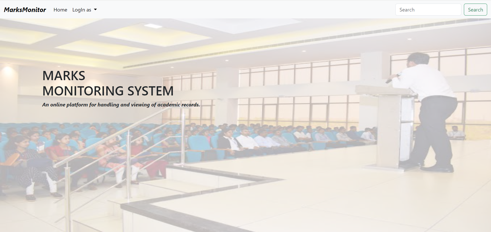
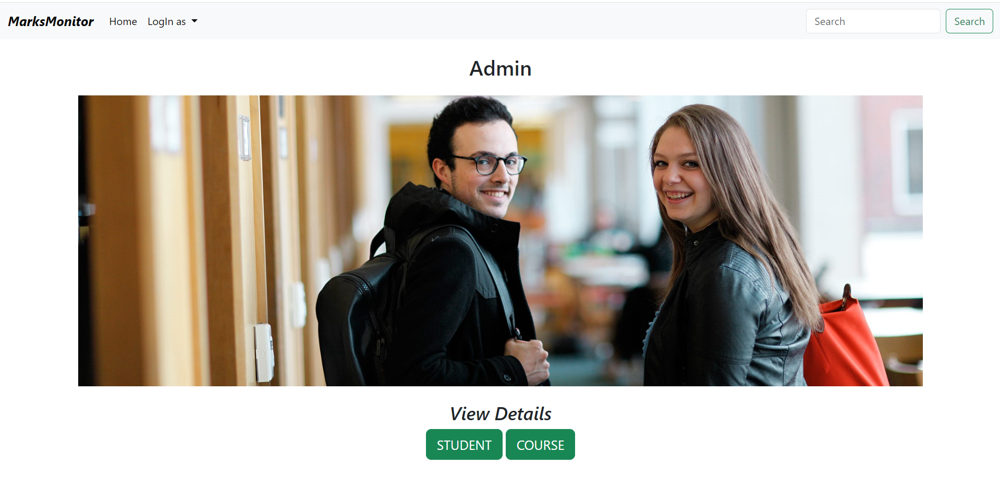
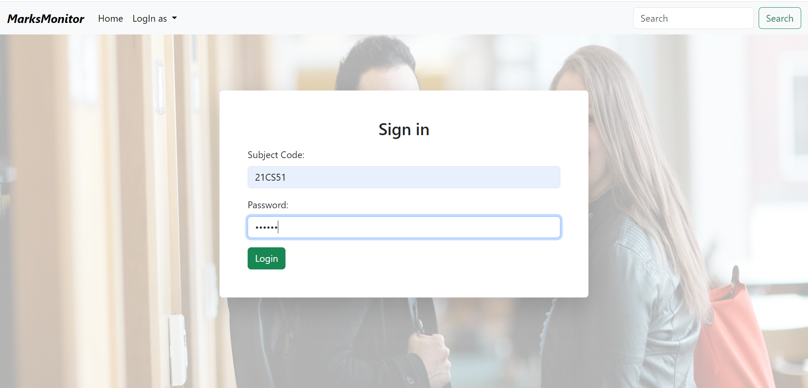
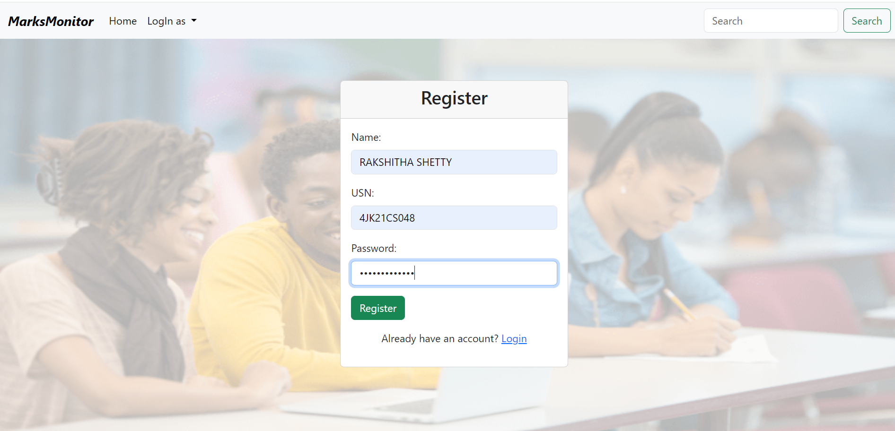
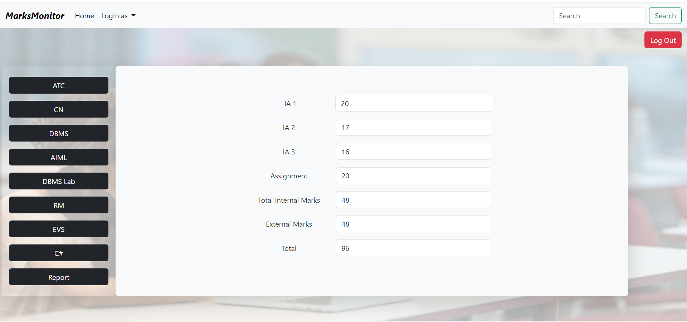
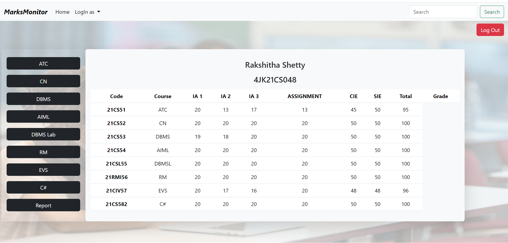

<h1 align="center">MARKS MONITORING SYSTEM</h1>
<h3 align="center">The Marks Monitoring System is a digital solution designed to streamline the process of managing and accessing student assessment marks within educational institutions. By focusing solely on the digitalization of student marks, the Marks Monitoring System aims to simplify and enhance the efficiency of academic record-keeping. The system consists of three key modules: the Admin Module, Faculty Module, and Student Module. The Admin Module provides administrators with tools to input and manage student details, ensuring accurate records and overseeing user accounts. Faculty members can utilize the Faculty Module to input, update, and review student assessment marks, simplifying grading tasks. Students benefit from the Student Module, which offers a personalized dashboard to access their assessment marks and monitor their academic progress. With its streamlined approach to digitalizing student marks, the Marks Monitoring System promotes efficiency, accuracy, and accessibility in academic record management, ultimately enhancing the educational experience for all stakeholders involved.</h3>

<h3 align="left">Softwares Required</h3>

- Development Environment: XAMPP (Apache, MySQL, PHP)
- Code Editor: Visual Studio Code (VS Code)
- Database Management System: MySQL
- Frontend Technologies: HTML, Bootstrap 5, JavaScript
- Backend: PHP

<h3 align="left">Home Page</h3>

<h3 align="left">Admin Log In Page</h3>

<h3 align="left">Admin Page</h3>

<h3 align="left">Student Details</h3>

<h3 align="left">Faculty Log In Page</h3>

<h3 align="left">Score Section</h3>

<h3 align="left">Student Registration page</h3>

<h3 align="left">Student Log In page</h3>

<h3 align="left">Subject wise mark distribution</h3>

<h3 align="left">Semester-End-Report</h3>

<h3 align="left">Connect with me:</h3>

  

<h3 align="left">Languages and Tools:</h3>

